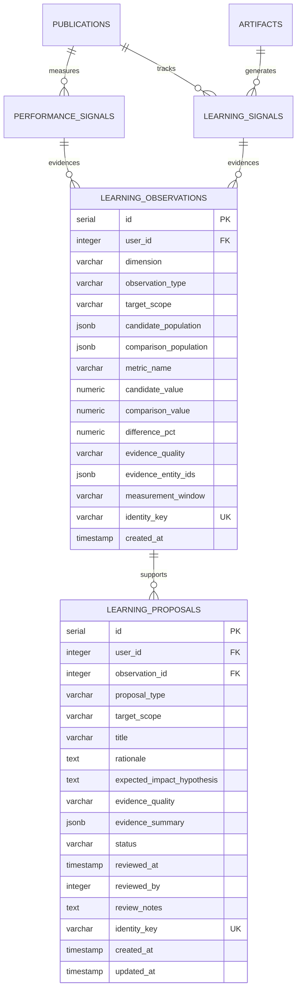

# ContentForge — Phase 29 Learning Architecture

**Document Status:** Complete Architecture Audit & Design  
**Phase:** 29.1 (Learning Foundation & Evidence-Backed Optimization)  
**Codename:** LEARN BEFORE YOU MUTATE  
**Baseline:** `a95e9c2` (Phase 28.2H)  
**Authoritative Persistence:** Durable PostgreSQL (`shared/schema.ts`)  
**Asynchronous Execution:** `pg-boss` job runtime (`server/jobs/`)

---

## 1. Executive Summary

Phase 29 introduces learning and optimization to ContentForge. In accordance with the foundational rule:
> **"LEARN BEFORE YOU MUTATE"**

Phase 29.1 implements the **Observe → Attribute → Learn → Propose** paradigm. It establishes a durable, explainable, versioned learning foundation without autonomously altering production generation policies, prompts, styles, or publishing configurations.

Every observation is grounded in durable PostgreSQL records. Every pattern retains explicit evidence provenance (entity IDs and sample sizes). Every proposal is human-reviewable through the existing `/insights?view=learning` surface.

---

## 2. Current Observable Signals Audit

ContentForge already captures rich empirical signals across its canonical lifecycle:
`ResearchJob → Story → Opportunity → GenerationJob → Artifact → approval → Schedule → Occurrence → Publication → Result`

### 2.1. Platform Performance Signals (`performanceSignals`)
* **Durable Table:** `performance_signals`
* **Canonical Metrics:** `impressions`, `likes`, `shares`, `comments`, `clicks`, `retries`, `views`, `engagements`
* **Integrity Guarantee:**
  * Availability state is explicitly recorded as `"observed"` or `"not_available"`.
  * Platform APIs that do not report a metric (or accounts without analytics access) are stored with `availability: "not_available"` and `value: null`.
  * **Rule:** Missing metrics are *never* coerced to `0` or treated as poor performance.
* **Lineage & Diagnostics:** Each record carries `userId`, `publicationId`, `resultId`, `artifactId`, `channel`, `provider`, `measurementWindow` (e.g. `24h`, `7d`), `normalizationVersion` (e.g. `performance.v1`), and bounded JSONB `provenance`.
* **Idempotency:** Unique index on `identity_key` (`performanceIdentityKey(...)`).

### 2.2. Content Lifecycle Learning Signals (`learningSignals`)
* **Durable Table:** `learning_signals`
* **Signal Types:**
  * `edit`: Captured upon creating an artifact revision. Compares prior vs new artifact payloads, computing character additions/removals, Levenshtein distance, semantic delta, and whether the revision occurred before/after approval or publication.
  * `approval`: Captured when an artifact is approved or rejected (`first_pass_approval`, `edited_then_approved`, `approved_after_multiple_revisions`, `rejected`).
  * `publication`: Captured upon dispatch outcome (`publication_succeeded`, `publication_failed`, retry count).
  * `performance`: Captured when metrics are refreshed for a publication.
  * `derived`: Secondary synthetic signals (e.g., `edit_required`, `approval_rejected`).
* **Lineage:** Links directly to `artifactId`, `priorArtifactId`, `publicationId`, `resultId`, `performanceSignalId`, `generationJobId`, `generationPolicyId`, `opportunityId`, `storyId`, and `automationRunId`.
* **Idempotency:** Unique index on `identity_key`.

### 2.3. Production & Telemetry Signals
* **Generation Jobs (`generationJobs`):** Records duration, prompt tokens, completion tokens, model name, provider, status (`succeeded`, `failed`), cost, and retry count.
* **Generation Policies (`generationPolicies`):** Snapshots of prompt templates, temperature, max tokens, system instructions, and format constraints.
* **Style Profiles (`styleProfiles`):** Reference sample count, confidence level, structured linguistic observations, and prompt snippets.
* **Automation Runs (`automationRuns`):** Workflow step execution, error classification, duration, and success/failure outcomes.

---

## 3. Existing Durable Entities & Lineage Map

| Entity | Durable Table | Key Observable Fields | Provenance / Foreign Keys |
| :--- | :--- | :--- | :--- |
| **Artifact** | `artifacts` | `format`, `channel`, `readiness`, `provenance` | `opportunityId`, `supersedesId`, `generationJobId` |
| **Story** | `stories` | `angle`, `themes`, `targetAudience` | `researchJobId`, `evidenceRefs` |
| **Opportunity** | `opportunities` | `channel`, `format`, `objective` | `storyId` |
| **Generation Job** | `generation_jobs` | `model`, `provider`, `durationMs`, `cost`, `status` | `policyId`, `opportunityId` |
| **Generation Policy**| `generation_policies`| `version`, `model`, `systemPrompt`, `rules` | Immutable snapshot per job |
| **Publication** | `publications` | `channel`, `state`, `scheduledFor` | `scheduleId`, `artifactId`, `userId` |
| **Result** | `results` | `outcome`, `externalId`, `deliveredAt` | `publicationId`, `channel` |
| **Performance Signal**| `performance_signals`| `metric`, `value`, `availability`, `window` | `publicationId`, `artifactId`, `userId` |
| **Learning Signal** | `learning_signals` | `signalType`, `payload`, `confidence` | `artifactId`, `pubId`, `policyId`, `storyId` |
| **Style Profile** | `style_profiles` | `name`, `confidence`, `sampleCount`, `rules` | `userId`, reference source IDs |
| **Automation Run** | `automation_runs` | `trigger`, `status`, `steps`, `errorClass` | `userId`, `opportunityId` |

---

## 4. Missing Joins & Lineage Gaps

While granular signals exist, the system previously lacked:
1. **Aggregated Pattern Observations (`learning_observations`):**
   * Durable persistence of multi-sample comparisons across defined dimensions (e.g. format A vs format B on channel X).
   * Explicit recording of candidate population vs baseline comparison population.
   * Deterministic evidence quality attribution (`insufficient_data` → `confirmed`).
2. **Durable Optimization Proposals (`learning_proposals`):**
   * Structured, versioned proposal records linking hypotheses to concrete observation IDs and entity evidence sets.
   * State machine for human-in-the-loop review: `proposed` → `accepted` | `rejected` | `superseded` | `expired`.
   * Clear separation between observation facts, inferred learnings, and non-mutating recommendations.

---

## 5. Evidence Quality & Deterministic Thresholds

To prevent vanity metrics and premature generalization, evidence quality is assigned deterministically based on sample size and observation consistency:

| Evidence Quality | Sample Size Threshold | Description / Interpretation | Proposal Eligibility |
| :--- | :--- | :--- | :--- |
| `insufficient_data`| $N < 3$ | Not enough data to infer any pattern. Raw metrics preserved. | Not eligible for proposals |
| `observed` | $3 \le N \le 5$ | Early signal detected. Inferred with low certainty. | Informational proposal |
| `directional` | $6 \le N \le 10$ | Moderate sample size indicating directional trend. | Standard proposal |
| `repeatable` | $11 \le N \le 20$ | Strong sample size demonstrating recurring pattern across multiple items. | High-confidence proposal |
| `confirmed` | $N > 20$ | Statistically robust, repeatable behavior across significant publishing history. | Top-tier confirmed proposal |

### Truthful Metrics Rules:
* **No Coercion:** Missing or unavailable metrics remain `not_available` with `null` values. They are never counted as `0`.
* **Denominator Visibility:** Summary aggregates report both `observedCount` and `notAvailableCount` so users see true measurement coverage.
* **Correlation $\ne$ Causality:** All generated text and proposals state observed correlations (e.g., *"Carousels had 24% higher observed engagement"*) rather than asserting unproven causal claims (*"Carousels cause higher engagement"*).

---

## 6. Proposed Learning Data Model

### 6.1. Entity Relationship Diagram

### 6.2. Table: `learning_observations`
* `id`: Serial primary key.
* `userId`: Tenant identifier, ensuring owner-scoped queries.
* `dimension`: `content` | `distribution` | `style` | `production`.
* `observationType`: Categorical pattern type (e.g. `format_channel_performance`, `style_approval_rate`, `model_cost_efficiency`, `workflow_reliability`).
* `targetScope`: Scope identifier (e.g. `channel:linkedin`, `format:carousel`, `provider:gemini`).
* `candidatePopulation`: JSONB containing criteria, sample count, and primary IDs.
* `comparisonPopulation`: JSONB containing baseline criteria, sample count, and comparison IDs.
* `metricName`: Normalized metric being compared (e.g. `engagement_rate`, `approval_rate`, `failure_rate`, `duration_ms`).
* `candidateValue`: Decimal observed value for candidate population.
* `comparisonValue`: Decimal observed value for comparison baseline.
* `differencePercentage`: Percentage delta ($(\text{cand} - \text{comp}) / \text{comp} \times 100$).
* `evidenceQuality`: `insufficient_data` | `observed` | `directional` | `repeatable` | `confirmed`.
* `evidenceEntityIds`: Bounded JSONB array of durable IDs (`artifactIds`, `publicationIds`, `resultIds`, `signalIds`).
* `measurementWindow`: Temporal window descriptor (e.g. `30d`, `all_time`).
* `identityKey`: Deterministic hash of `(userId, dimension, observationType, targetScope, metricName, measurementWindow)`.

### 6.3. Table: `learning_proposals`
* `id`: Serial primary key.
* `userId`: Tenant identifier.
* `observationId`: Foreign key to `learning_observations.id` (optional, for direct pattern linkage).
* `proposalType`: `format_distribution` | `style_association` | `cost_efficiency` | `workflow_reliability`.
* `targetScope`: Scope string.
* `title`: Concise, descriptive proposal summary.
* `rationale`: Clear, evidence-grounded explanation of what was observed.
* `expectedImpactHypothesis`: Testable prediction of expected improvement if adopted.
* `evidenceQuality`: Evidence quality state from the supporting observation.
* `evidenceSummary`: Structured snapshot of sample counts, candidate vs baseline metrics, and top source IDs.
* `status`: `proposed` | `accepted` | `rejected` | `superseded` | `expired`.
* `reviewedAt`: Timestamp of human action.
* `reviewedBy`: User ID who reviewed the proposal.
* `reviewNotes`: Optional user remarks.
* `identityKey`: Deterministic hash ensuring idempotent regeneration.
* `createdAt` / `updatedAt`: Standard audit timestamps.

---

## 7. Learning Dimensions & Deterministic Pattern Extraction

Phase 29.1 implements deterministic aggregation and comparison over empirical data across four core dimensions:

1. **Content & Distribution Dimension:**
   * Format performance by channel: Compares engagement rate, likes, or impressions for a given format (e.g. LinkedIn Carousel vs LinkedIn Post, or X Thread vs X Single Post).
   * Generates proposals when sample size $\ge 3$ and observed engagement rate exhibits $\ge 15\%$ difference against channel baseline.
2. **Style Dimension:**
   * Style profile approval & edit frequency: Compares first-pass approval rate across active style profiles.
   * Identifies style profiles associated with higher first-pass approvals vs those requiring extensive human rework.
3. **Production & Cost Dimension:**
   * Model latency and cost efficiency: Evaluates average duration and cost per successful generation across providers/models.
   * Highlights opportunities where faster/cheaper models deliver comparable approval rates.
4. **Workflow & Reliability Dimension:**
   * Workflow step completion vs failure/retry rates: Aggregates publication dispatch failures and retry frequencies by channel or provider.

---

## 8. Human-in-the-Loop & Insights Integration

Proposals are surfaced directly in the existing canonical `/insights?view=learning` route.

### 8.1. UI Three-Tier Clarity:
* **Observed:** Exactly what the system measured (raw publication metrics, coverage denominators, observed totals).
* **Learned:** Inferred patterns with explicit evidence quality badges (`observed`, `directional`, `repeatable`, `confirmed`).
* **Proposed:** Actionable optimization candidates with clear hypotheses and Human-in-the-Loop review buttons:
  * **Accept:** Marks proposal as `accepted`, recording `reviewedAt`. Does NOT automatically rewrite policies or prompts.
  * **Dismiss (Reject):** Marks proposal as `rejected`.

### 8.2. Evidence Drill-Down UX:
Each proposal includes an expandable evidence inspector displaying:
* Sample count and comparison population.
* Observed vs comparison metrics and percentage delta.
* Referenced artifact and publication IDs.
* Deterministic evidence quality status.

---

## 9. Explicit Non-Goals for Phase 29.1

To maintain architectural safety, the following are strictly excluded from Phase 29.1:
1. **NO Autonomous Mutation:** No automatic prompt rewriting, no automatic `GenerationPolicy` mutation, no automatic style profile modifications, and no automatic provider routing changes.
2. **NO New Destinations:** The canonical 7-destination IA (`/today`, `/create`, `/sources`, `/agent`, `/schedule`, `/insights`, `/settings`) is preserved. No new navigation items or separate analytics hubs.
3. **NO External Paid Media Generation:** Zero calls to fal.ai, ElevenLabs, or paid third-party AI image/video generators.
4. **NO In-Memory / Secondary Storage:** PostgreSQL remains the sole authoritative store; `pg-boss` remains the asynchronous job runtime.
5. **NO TikTok Work:** Outside current scope.
