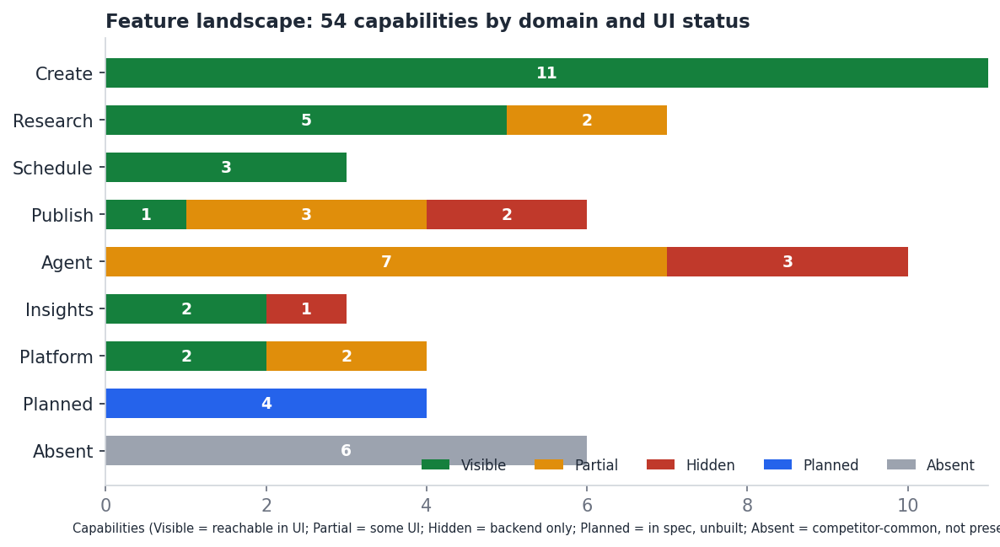

# Feature Matrix

Part of the ContentForge UX intelligence package. Discovery only.

## Method

The matrix compares what the backend can do, what the UI exposes, what the product notes plan, and what comparable tools advertise. It does not score features. Status is one of five values, based on repo evidence and live walkthroughs.

| Status | Meaning |
|---|---|
| Visible | Backend capability and a reachable UI |
| Partial | Some UI exists but it is incomplete, hardcoded, mispositioned or reachable only inside another screen |
| Hidden | Backend route exists; no UI calls it |
| Planned | The product spec names a screen that does not exist |
| Absent | Advertised by comparable tools; no trace in ContentForge |

**54 capabilities:** 24 Visible, 14 Partial, 6 Hidden, 4 Planned, 6 Absent.

## The main pattern

The backend has moved ahead of the UI. The backend registers about 270 routes; the client calls 127 distinct API paths. Phases 21-28 added Video Factory, agent runtime, style intelligence, mass repurposing, research intelligence, OpenShorts, ElevenLabs and fal media, and a YouTube channel adapter. The UI for all of it lives inside one screen (Agent Workspace), and six capabilities have no UI at all. Meanwhile the 20 legacy pages keep growing sideways (Create alone has 11 items).

## Hidden: backend value with no UI

| ID | Domain | Capability | Backend evidence | UI evidence | Status | Confidence |
|---|---|---|---|---|---|---|
| F26 | Publish | Publication dispatch, status and result API | content/routes.ts:1022-1065 | None | Hidden | HIGH |
| F27 | Publish | Channels API | content/routes.ts:1078 | None | Hidden | HIGH |
| F35 | Agent | Voices (create, revise, archive, revisions) | content/routes.ts:1083-1142 | None | Hidden | HIGH |
| F36 | Agent | Generation policies | content/routes.ts:1230-1238 | None | Hidden | HIGH |
| F37 | Agent | Automation policies, runs, tick | content/automationRoutes.ts:137-259 | None | Hidden | HIGH |
| F38 | Insights | Learning signals, summary, publication performance | content/learning/routes.ts:50-71 | None | Hidden | HIGH |

## Partial

| ID | Domain | Capability | Backend evidence | UI evidence | Status | Confidence |
|---|---|---|---|---|---|---|
| F17 | Research | Quick Capture (Cmd/Ctrl+Shift+I) | /api/ingest | quick-capture.tsx - button mispositioned (UX-01) | Partial | HIGH |
| F18 | Research | Canonical research pipeline (ResearchJob > Story > Opportunity) and research intelligence | server/research, server/story | Agent Workspace Research panel only | Partial | HIGH |
| F23 | Publish | Threads publishing | backend threads tests present | Queue says 'coming soon' | Partial | MEDIUM |
| F24 | Publish | YouTube ChannelAdapter (live-certified per repo docs) | server/content/youtube* | Settings YouTube card read 'Not ready' in the error-state capture; youtube.tsx is a YouTube-to-post tool | Partial | MEDIUM |
| F25 | Publish | Canonical Schedule / Occurrence / Publication | server/content/scheduling.ts, publication.ts | artifact-review.tsx Schedule (+60s hardcoded) | Partial | HIGH |
| F28 | Agent | Agent runtime with AG-UI streaming | server/agent/routes.ts | agent.tsx (417 lines) | Partial | HIGH |
| F29 | Agent | Artifact review (draft > in_review > approved/rejected) | server/content/artifact.ts | artifact-review.tsx | Partial | HIGH |
| F30 | Agent | Run-level approval resume | agent/routes.ts:248 | Displays state; never calls /resume | Partial | MEDIUM |
| F31 | Agent | Video Factory / OpenShorts / fal media | server/content/videoFactory* | video-panel.tsx ('No processing-ready video provider') | Partial | HIGH |
| F32 | Agent | Audio (ElevenLabs) | server/content/visual.audio* | audio-panel.tsx | Partial | HIGH |
| F33 | Agent | Mass repurposing | server/content/repurposing.ts | repurpose-panel.tsx | Partial | HIGH |
| F34 | Agent | Style intelligence | server/content/style*.ts | style-panel.tsx | Partial | HIGH |
| F42 | Platform | Settings: accounts, AI provider, pillars, brand | legacy API | settings.tsx (AI tab hardcoded, UX-05) | Partial | HIGH |
| F44 | Platform | Per-platform post preview | - | x-post-preview.tsx (X only) | Partial | MEDIUM |

## Planned but unbuilt, and Absent

Absent items are competitor-common features with no trace in ContentForge. Absent does not mean "should build". See DONT_BUILD.md.

| ID | Domain | Capability | Backend evidence | UI evidence | Status | Confidence |
|---|---|---|---|---|---|---|
| F45 | Planned | Daily morning briefing | - | briefing.tsx does not exist (spec) | Planned | HIGH |
| F46 | Planned | Engagement surface | - | engagement.tsx does not exist (spec) | Planned | HIGH |
| F47 | Planned | Composer page | - | composer.tsx does not exist (spec) | Planned | HIGH |
| F48 | Planned | PWA / installable mobile capture | - | client/public has only favicon.png; no manifest or service worker | Planned | HIGH |
| F49 | Absent | Command palette / shortcut map | - | cmdk primitive unused | Absent | HIGH |
| F50 | Absent | Bulk / CSV scheduling (Buffer, Publer) | - | Not observed | Absent | MEDIUM |
| F51 | Absent | Evergreen recycling (Hypefury, Publer) | - | Not observed | Absent | MEDIUM |
| F52 | Absent | Auto-DM / auto-plug / auto-repost (Hypefury, Typefully) | - | Queue banner states 'no auto-replies, DMs' - deliberate | Absent | HIGH |
| F53 | Absent | Drag-and-drop calendar rescheduling (Publer) | - | Not observed in calendar.tsx interaction | Absent | MEDIUM |
| F54 | Absent | Team roles / multi-user approvals (Buffer, Postiz, Publer) | - | Deferred by spec (single operator) | Absent | HIGH |

## Visible

| ID | Domain | Capability | Backend evidence | UI evidence | Status | Confidence |
|---|---|---|---|---|---|---|
| F01 | Create | Generate 3 variations (pillar, type, tone, platform) | legacy generate API | generate.tsx (518 lines) | Visible | HIGH |
| F02 | Create | Unicode formatter and thread splitter | client-side libs | formatter.tsx; generate.tsx; lib/unicode-formatter.ts, thread-splitter.ts | Visible | HIGH |
| F03 | Create | Hook generator | legacy API | hooks.tsx | Visible | HIGH |
| F04 | Create | Carousel builder | legacy API | carousel.tsx | Visible | HIGH |
| F05 | Create | AI images | legacy API | imagegen.tsx | Visible | HIGH |
| F06 | Create | X Articles editor (tiptap) | legacy API | articles.tsx, tiptap-editor.tsx | Visible | HIGH |
| F07 | Create | Templates | legacy API | templates.tsx | Visible | HIGH |
| F08 | Create | Canned responses | legacy API | canned-responses.tsx | Visible | HIGH |
| F09 | Create | Chat to post | chat routes (not traced) | chat.tsx | Visible | HIGH |
| F10 | Create | YouTube to post | server/youtubeConnector.ts (not traced) | youtube.tsx | Visible | HIGH |
| F11 | Create | Viral score and optimize | legacy API | Icon-only buttons inside generate.tsx | Visible | HIGH |
| F12 | Research | Ingest URL / text | /api/ingest | ingest.tsx (710 lines) | Visible | HIGH |
| F13 | Research | Discover feed (HN, Reddit, RSS, GitHub, ArXiv, Trends) | discoverRefresh.ts, marketPulse.ts | discover.tsx (780 lines) | Visible | HIGH |
| F14 | Research | Context Vault | server/content/context.ts (assumed; not traced) | vault.tsx | Visible | HIGH |
| F15 | Research | References / source analysis | legacy API | references.tsx | Visible | HIGH |
| F16 | Research | Ideas bank | legacy API | ideas.tsx | Visible | HIGH |
| F19 | Schedule | Queue (draft > ready > scheduled > posted) | legacy API | queue.tsx (617 lines) | Visible | HIGH |
| F20 | Schedule | Month calendar with post-detail dialog and picker | legacy API | calendar.tsx | Visible | HIGH |
| F21 | Schedule | Best-times hint | legacy API | 'Best Times' control on Calendar | Visible | MEDIUM |
| F22 | Publish | Publish to X (official API / xQuick) | server/social | queue.tsx 'Post to X'; settings connect | Visible | HIGH |
| F39 | Insights | Analytics dashboard | legacy API | analytics.tsx | Visible | HIGH |
| F40 | Insights | AI usage | legacy API | ai-usage.tsx and an Analytics tab (duplicate) | Visible | HIGH |
| F41 | Platform | Auth, session, CSRF | server/auth.ts, middleware/csrf.ts | auth.tsx | Visible | HIGH |
| F43 | Platform | Theme | - | theme-provider.tsx, theme-toggle.tsx | Visible | HIGH |

## What comparable tools advertise versus ContentForge

Vendor statements come from each vendor's own page (see COMPETITIVE_RESEARCH.md); nothing was trialled hands-on.

| Capability | Who advertises it | ContentForge today | Relevance to a single operator |
|---|---|---|---|
| Queue and calendar as one schedule | Typefully (calendar), Buffer (queue and calendar), Publer (calendar) | Both exist as separate pages | HIGH: already built; the gap is structural (IA) |
| Post preview before sending | Typefully, Publer | X preview exists inside Calendar; not observed in Generate or Agent review | HIGH: reuse `x-post-preview.tsx` |
| Voice-matched AI | Hypefury, Taplio | Style intelligence and voices exist in the backend; only a Style panel is in the UI | MEDIUM: core to brand goal; UI is thin |
| Keyboard shortcuts | Typefully | One shortcut | MEDIUM |
| Approval workflow | Buffer, Publer | Artifact review exists; single-user | LOW as team feature; HIGH as agent-approval control |
| Bulk scheduling | Publer | Absent | LOW until volume demands it (HYPOTHESIS) |
| Content recycling | Hypefury, Publer | Absent | HYPOTHESIS |
| Auto-DM, auto-plug, auto-repost | Hypefury, Typefully | Absent, and the Queue banner and the repo's compliance document exclude auto-replies and DMs | Conflicts with the owner's stated stance |
| Inspiration library of viral posts | Hypefury, Taplio | Discover feed (sources, not viral posts) | Different approach; keep |
| MCP or API for outside agents | Taplio, Postiz, Typefully | Not investigated in this pass | Open question |
| A stated "minutes a day" ritual | Taplio ("10 min/day") | Product notes state ~5 minutes | Aligns |
| Team roles | Postiz, Buffer | Deferred by spec | None now |

## Pruning view (Phase 13, candidate actions)

Nothing here says a feature is unused. Actions are candidates for the owner to confirm with usage data (HYPOTHESIS unless noted).

| Capability | Candidate action | Reason | Confidence |
|---|---|---|---|
| Post Formatter | Fold into Generate | The same formatting and thread splitting already exist inside Generate | MEDIUM |
| Hook Generator, Carousel Builder | Present as Generate modes | Same input shape (topic, tone), different output type | HYPOTHESIS |
| Templates, Canned Responses | Insert menus inside editors | Both are reusable text | HYPOTHESIS |
| References and Vault | Merge as saved sources | Both hold source material | MEDIUM |
| Ideas Bank and Discover | Decide one list or two | Overlapping purpose | HYPOTHESIS (Q2) |
| YouTube > Post, Chat > Post | Route through the single ingest / agent entry | Same job, more entry points | MEDIUM |
| AI Usage tab inside Analytics | Remove the duplicate | Same content as the AI Usage page | HIGH |
| Compliance banners (4 copies) | One shared component, shown once | Same message repeated | HIGH |
| CopilotKit provider | Unmount until a Copilot UI exists | No visible function; causes a 403 | HIGH (UX-09) |
| Agent demo prompt and "fixture" backend | Hide behind a developer setting | Not operator-facing | MEDIUM |

## Feature clusters (Phase 12 landscape)

| Cluster | Members |
|---|---|
| Produce | Generate, Formatter, Hooks, Carousel, Images, Articles, Templates, Canned, Chat > Post, YouTube > Post, viral score |
| Source | Ingest, Discover, Vault, References, Ideas, Quick Capture, canonical research pipeline |
| Decide and send | Queue, Calendar, best times, publish to X, canonical schedule and publication, artifact review, run approval |
| Delegate | Agent runtime, video, audio, repurposing, style, voices, generation policies, automation |
| Learn | Analytics, AI usage, learning signals |
| Platform | Auth, Settings, theme |

The "Learn" cluster is the thinnest in the UI relative to its backend. That is a finding (F38), not a recommendation to build; see UX_ROADMAP.md R17 for the dependency on the model decision (R10).
