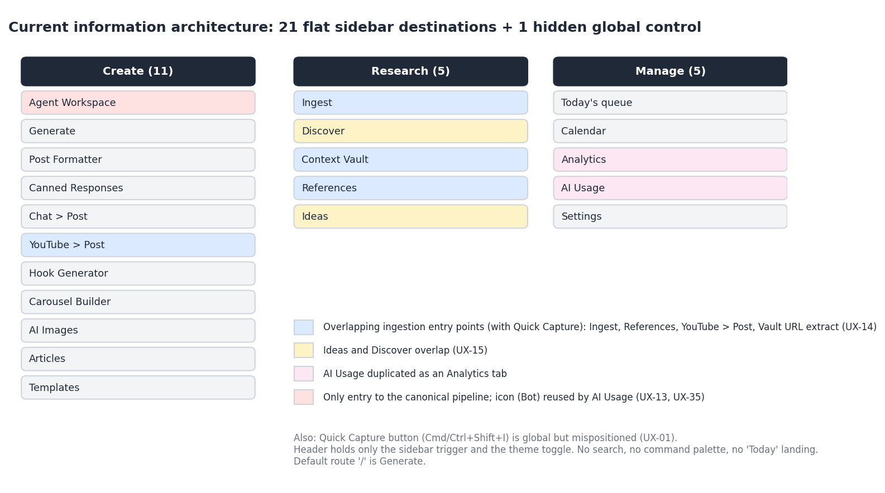
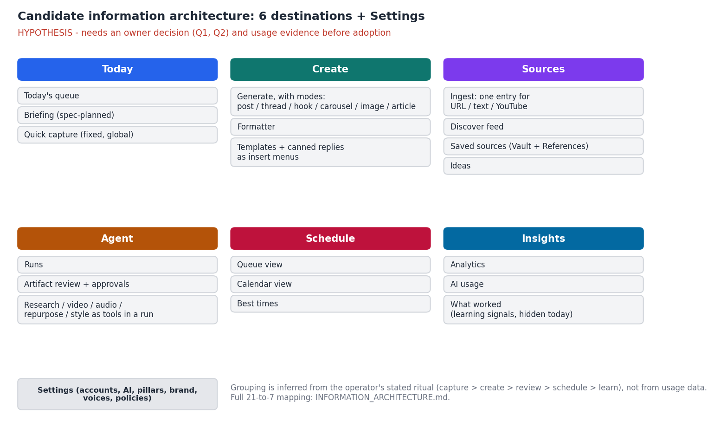

# Information Architecture

Part of the ContentForge UX intelligence package. Discovery only: the candidate structure below is a hypothesis to decide on, not a redesign.

## 1. Current structure (fact)

The sidebar has 21 flat destinations in three groups, plus a global Quick Capture control. The default route `/` is Generate. The header contains only the sidebar trigger and the theme toggle. There is no search, no command palette and no landing view.

| Group | Nav label | Route | Page title (H1) | Content model | Notes |
|---|---|---|---|---|---|
| Create | Agent Workspace | /agent | Agent Workspace | Canonical (Artifact) | Only entry to the canonical pipeline. Uses the Bot icon, which AI Usage also uses |
| Create | Generate | / | Generate Content | Legacy (post) | Landing page |
| Create | Post Formatter | /formatter | Post Formatter | Client-side | Unicode formatting and thread splitting also exist inside Generate |
| Create | Canned Responses | /canned-responses | Canned Responses | Legacy | |
| Create | Chat > Post | /chat | Chat > Post | Legacy | |
| Create | YouTube > Post | /youtube | YouTube > X Post | Legacy | One of five ingestion surfaces |
| Create | Hook Generator | /hooks | Hook Generator | Legacy | |
| Create | Carousel Builder | /carousel | Carousel Builder | Legacy | |
| Create | AI Images | /images | AI Image Generation | Legacy | |
| Create | Articles | /articles | X Articles | Legacy | Label differs from title |
| Create | Templates | /templates | Template Library | Legacy | |
| Research | Ingest | /ingest | Ingest Content | Legacy | Ingestion surface |
| Research | Discover | /discover | Idea Discovery | Legacy | Label differs; overlaps Ideas |
| Research | Context Vault | /vault | Context Vault | Legacy | Has its own URL extraction |
| Research | References | /references | Source Analysis | Legacy | Label differs; ingestion surface |
| Research | Ideas | /ideas | Ideas Bank | Legacy | Label differs; overlaps Discover |
| Manage | Today's queue | /queue | Today's Queue | Legacy | Where scheduling happens |
| Manage | Calendar | /calendar | Content Calendar | Legacy | |
| Manage | Analytics | /analytics | Analytics | Legacy | Contains an AI Usage tab |
| Manage | AI Usage | /ai-usage | AI Usage & Cost | Legacy | Duplicate of the Analytics tab |
| Manage | Settings | /settings | Settings | - | Tabs: Connected Accounts, AI Provider, Content Pillars, Brand Profile |

## 2. What the structure gets wrong (evidence)

| Issue | Evidence |
|---|---|
| 21 flat items; the bottom group is clipped at 900 px height; 22 tab stops before content | UX-12 |
| Two content models with no bridge in the UI | UX-13 |
| Five overlapping ways to bring content in | UX-14 |
| Ideas and Discover overlap | UX-15 |
| Six labels differ from their page titles | UX-16 |
| Internal vocabulary shown to the user: Artifact, Opportunity, Story, ResearchJob, "UNTRUSTED", fixture | UX-17 |
| The most important daily destination (Queue) is under "Manage", and the landing page is a generator | UX-19, F45 |
| Hidden backend capabilities have no home at all (voices, policies, learning) | F35-F38 |

The structure also has real strengths: verbs and nouns are mostly plain, the three groups follow a create > research > manage logic, and every page has one H1.

## 3. Candidate structure (hypothesis)

The candidate follows the ritual the product notes describe: capture, create, review, schedule, learn.

| Destination | Purpose | Absorbs |
|---|---|---|
| Today | What needs me now: due and scheduled posts, items awaiting review, capture | Today's queue; the spec-planned briefing; Quick Capture |
| Create | Produce a post in any format | Generate, Hook Generator, Carousel Builder, AI Images and Articles as modes; Formatter; Templates and Canned Responses as insert menus |
| Sources | Everything the content is derived from | Ingest (single entry for URL, text, YouTube), Discover, Ideas, Vault and References as saved sources |
| Agent | Delegated runs and their outputs | Agent Workspace, with research, video, audio, repurpose and style as tools inside a run |
| Schedule | When things go out | Queue and Calendar as two views of one schedule; best times |
| Insights | What worked | Analytics, AI Usage, and the learning signals that are hidden today |
| Settings | Configuration | Accounts, AI provider, pillars, brand, and future voices and policies |

### Mapping of the 21 current destinations

| Current | Candidate destination | Action |
|---|---|---|
| Agent Workspace | Agent | Keep, rename internals to plain language |
| Generate | Create | Keep as the core; add modes |
| Post Formatter | Create | Fold in (also exists inside Generate) |
| Canned Responses | Create | Turn into an insert menu |
| Chat > Post | Create or Agent | Open: depends on Q1 |
| YouTube > Post | Sources | Merge into a single ingest entry |
| Hook Generator | Create | Mode |
| Carousel Builder | Create | Mode |
| AI Images | Create | Mode or asset picker |
| Articles | Create | Mode (distinct editor) |
| Templates | Create | Insert menu |
| Ingest | Sources | Keep as the single entry |
| Discover | Sources | Keep |
| Context Vault | Sources | Merge with References as saved sources |
| References | Sources | Merge with Vault |
| Ideas | Sources | Open: merge with Discover or keep (Q2) |
| Today's queue | Today and Schedule | Split: today's due view vs full queue |
| Calendar | Schedule | Second view of the same schedule |
| Analytics | Insights | Keep |
| AI Usage | Insights | Keep one copy; remove the duplicate tab |
| Settings | Settings | Keep |

Result: 21 sidebar items become 6 destinations plus Settings. Labels and page titles become identical.

### Confidence and what would change it

| Statement | Confidence | Would change if |
|---|---|---|
| 21 flat items is too many for a daily-ritual tool | HIGH that it clips and forces recall; MEDIUM that seven is the right number | The operator says he uses only a few pages regularly. That would argue for hiding rather than merging |
| Queue and Calendar are views of one schedule | MEDIUM | The operator prefers them as separate mental models |
| Merging generators into modes helps | HYPOTHESIS | Usage shows one generator dominates, or a mode needs its own workflow |
| Ingestion should have a single entry | HIGH that five is confusing; MEDIUM on the fix | Different sources need genuinely different flows |
| Ideas and Discover should merge | HYPOTHESIS | Q2 |

## 4. Decisions needed before any IA work

1. **Which content model is the UI's source of truth** (legacy posts or the canonical Artifact pipeline)? The IA above cannot be finalised without this (Q1).
2. **Ideas versus Discover** (Q2).
3. **Which pages does the operator open weekly?** A one-week count of route visits would replace guesses. No such data exists today (Q3).

## 5. Navigation behaviours to preserve

- Grouped, labelled sidebar with icons and active state.
- The dark/light toggle.
- The global capture shortcut (once repaired).
- One H1 per page.

## 6. Validation approach for a single-user product

A card sort is not meaningful with one user. Cheaper, stronger checks: (1) instrument route visits for a week; (2) ask the operator to name the three destinations he opens first each morning; (3) walk J2 and J5 in the candidate structure and count steps against today's 8 (J2).
