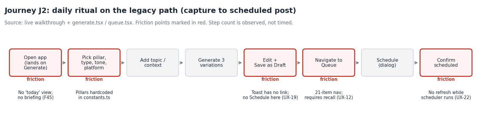
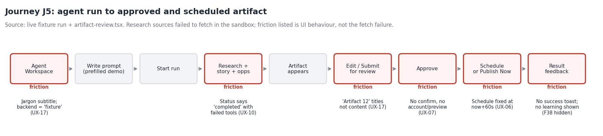

# User Journeys

Part of the ContentForge UX intelligence package. Discovery only.

## Who the user is

The repo's own product notes describe one operator: Kishore Kumar Behera, an Infra Engineering Lead (SRE / DevOps), building a personal brand on X (with Threads, LinkedIn and YouTube as secondary channels). The stated goal is a roughly five-minute daily ritual that grows the brand and X revenue share (5M impressions in 90 days). Multi-tenant use and billing are explicitly deferred.

No personas were invented. There is one known user, and no usage analytics exist to describe how he actually works. Journeys below are therefore traced from the code and from live walkthroughs, and "expected" behaviour is taken from the product notes.

Confidence: journey steps are HIGH where walked in the live app or read in code. Statements about how often or how long are not made, because nothing was timed.

## Journey map

| ID | Journey | Path through the app | Status |
|---|---|---|---|
| J1 | First run: sign in and connect X | Auth > Generate (landing) > Settings > Connected Accounts | Walked live |
| J2 | Daily ritual: idea to scheduled post (legacy path) | Generate > Save as Draft > Queue > Schedule | Walked live to the AI call; the AI backend was unreachable by design |
| J3 | Idea discovery to post | Discover > idea dialog > draft > publish, schedule or Queue | Read in code, partly walked |
| J4 | Bring in a source | Quick Capture / Ingest / References / YouTube > Post / Vault | Walked live (error paths) |
| J5 | Agent run to approved, scheduled artifact | Agent Workspace > run > Artifact review > Approve > Schedule / Publish Now | Walked live with the fixture backend |
| J6 | Review performance and learn | Analytics (and the unbuilt learning surfaces) | Read in code; no real data |
| J7 | Recover when something fails | Any page with an API or publish failure | Failure injected on reads; publish failure read in code |

## J1. First run

| Step | What happens | Friction | Evidence |
|---|---|---|---|
| 1 | Auth page with Login and Register tabs | The submit button is disabled until fields are filled, with no explanation | UX-29 |
| 2 | Register with a short password | The 6-character rule appears only after the server rejects it, as a raw toast | UX-04, UX-29 |
| 3 | Signed in; the app lands on Generate | No welcome, no setup checklist, no "connect X first" prompt. The user sees a generator that cannot publish anywhere yet | Observed |
| 4 | Settings > Connected Accounts | X connection is described in terms of an xQuick API key and account ID from a separate dashboard. Setup requires leaving the app | settings.tsx, settings-error capture |
| 5 | Any accounts-API failure | Shows "Connect" as if nothing is connected | UX-03 |

## J2. Daily ritual, legacy path

Observed steps from landing to a scheduled post: open the app (lands on Generate), choose pillar, type, tone and platform, add a topic or context, generate three variations, edit and Save as Draft, navigate to Queue, open the Schedule dialog, confirm. That is 8 distinct actions before the post is scheduled. Not timed.

| Friction | Detail | Evidence | Confidence |
|---|---|---|---|
| No "today" view | The landing page is a blank generator. Nothing tells the operator what is scheduled, what is due, or what needs review | Spec plans `briefing.tsx`; it does not exist (F45) | HIGH |
| Dead end after save | "Save as Draft" shows a toast with no link. Generate has no Schedule action | UX-19 | HIGH |
| Navigation by recall | Queue is 1 of 21 sidebar items, under a group called "Manage" | UX-12 | HIGH |
| Mark Ready is optional but prominent | Queue offers Schedule on drafts (queue.tsx:415). The presence of a separate Mark Ready step can imply a required gate that is not one | UX-19 | MEDIUM |
| Silent staleness | With `staleTime: Infinity`, a status change made by the background scheduler does not appear until reload (Queue overrides to 5 minutes) | UX-22 | Fact HIGH, impact HYPOTHESIS |
| Error on generation | Failure shows `500: {"message":"Failed to generate content. Please try again."}` | UX-04 | HIGH |

Pattern worth keeping: the Calendar's post dialog already provides a rendered tweet preview and a real date/time picker (see `evidence-screenshots/15-calendar-post-detail-good-pattern.png`). Generate could reuse it.

## J3. Discovery to post

Discover scans HN, Reddit, RSS, GitHub, ArXiv and Google Trends, ranks ideas, and lets the operator open an idea in a dialog, create a draft, and then publish now, schedule, or go to the Queue. This path already offers what Generate lacks (a next step after drafting). It is the closest thing to a finished loop in the legacy app.

| Friction | Evidence | Confidence |
|---|---|---|
| A feed failure shows "0 ideas" instead of an error | UX-03 | HIGH |
| Ideas Bank and Idea Discovery both hold ideas | UX-15 | MEDIUM |
| The compliance banner repeats on Queue, Discover, Ingest and References | UX-18 | HIGH |

## J4. Bring in a source

Five surfaces accept external content: Quick Capture, Ingest, References ("Source Analysis"), YouTube > Post, and Vault URL extraction (UX-14).

| Step | Friction | Evidence |
|---|---|---|
| Open Quick Capture (Cmd/Ctrl+Shift+I or the button) | The button is mispositioned on every breakpoint; the keyboard shortcut works | UX-01 |
| Enter a URL that cannot be fetched | Toast: `400: {"message":"Could not fetch URL: ... Try pasting the content instead."}`. Quick Capture has no paste-text field, so the advice cannot be followed there | UX-04, UX-14 |
| Choose where to go instead | The operator must know that Ingest is the fuller page | UX-14 |

## J5. Agent run to approved, scheduled artifact

| Step | What happens | Friction | Evidence |
|---|---|---|---|
| 1 | Open Agent Workspace (first item under Create) | Subtitle "CopilotKit + AG-UI over ContentForge Agent Runtime"; backend selector shows "fixture" | UX-17 |
| 2 | Composer is prefilled with a demo prompt; Start run | The browser drives the run loop for the fixture backend | agent.tsx |
| 3 | Progress: research, story, opportunities | Badge says "completed" while tool calls show failures | UX-10 |
| 4 | Artifact appears in the right rail | Titles are "Artifact 12" and "Revision 1 #5", not content. On mobile the panel is the last of six stacked panels | UX-11, UX-17 |
| 5 | Edit, Regenerate, Submit for review | Good: badges distinguish "Agent suggestion" from "User approval" | Positive |
| 6 | Approve | Approve and Publish Now are adjacent primary actions; no confirm, no account or post preview | UX-07 |
| 7 | Schedule | Fixed at now + 60 seconds; no date or time input | UX-06 |
| 8 | Result | No success toast; no learning signal shown (the backend has them, no UI) | F38 |
| Alt | A run waits for approval | Text says authorization is required; there is no approve or deny control and `/resume` is never called | UX-08 |
| Alt | Open the page | A 403 from the CopilotKit POST fires every time | UX-09 |

## J6. Review performance and learn

Analytics shows totals (posts, impressions, likes, replies), by pillar and by platform, plus an "AI Usage" tab that duplicates the AI Usage page. Backend learning signals, a summary endpoint and publication performance exist (F38) but have no screen, so nothing tells the operator what to do differently tomorrow. A failed analytics read renders zeros (UX-03). One overlapping-label chart artifact was seen (UX-36, LOW).

## J7. Recovery

| Situation | What the operator sees | Evidence |
|---|---|---|
| A list fails to load | The empty state, indistinguishable from "no data" | UX-03 |
| A mutation fails | A toast with status code and JSON | UX-04 |
| A scheduled publish fails | Queue groups a "failed" status (queue.tsx:277). How the operator retries or diagnoses is not verified | Not exercised; HYPOTHESIS that recovery is unclear |
| A delete is a mistake | No undo | UX-02 |
| The session expires | No global 401 handling in the query client | queryClient.ts |

## Open questions for the owner

1. Which of J2 and J5 is the path you want to be the daily ritual: the legacy Generate/Queue loop or the Agent Workspace loop? (Q1 in the main report.)
2. Do you open Ideas Bank and Discover as one list or two?
3. When a scheduled post fails to publish, what do you want to happen and how do you want to find out?
