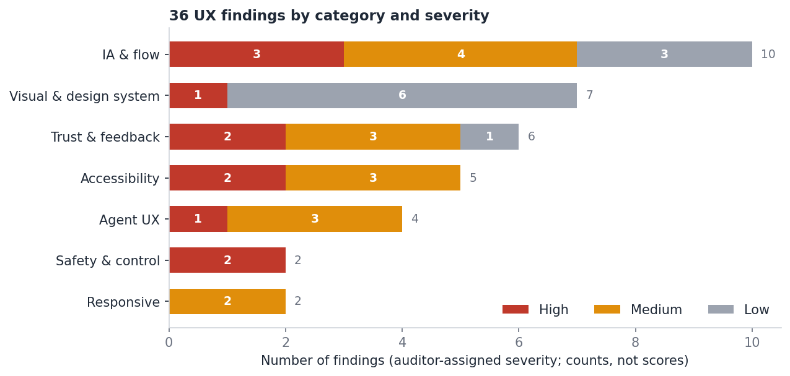
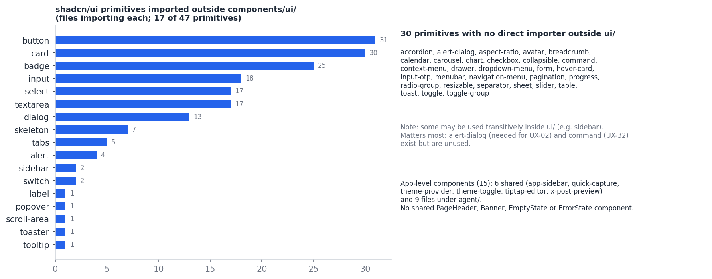
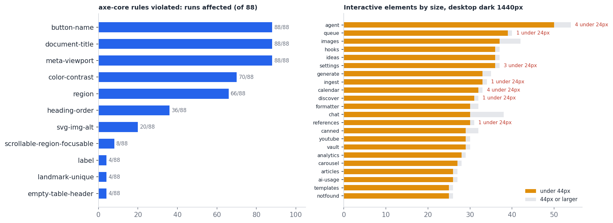

# ContentForge UX Intelligence Report

Discovery only. No production code was modified, nothing was redesigned, and no scores, personas, analytics or requirements were invented. Every recommendation carries evidence and a confidence label (HIGH / MEDIUM / LOW / HYPOTHESIS). Facts are kept separate from assumptions.

Package contents: this report, FEATURE_MATRIX.md, USER_JOURNEYS.md, INFORMATION_ARCHITECTURE.md, DESIGN_SYSTEM_AUDIT.md, COMPETITIVE_RESEARCH.md, UX_ROADMAP.md, DONT_BUILD.md, SKILL_RECOMMENDATIONS.md, EVIDENCE_LEDGER.md, plus `visuals/` (nine charts and diagrams) and `evidence-screenshots/` (fifteen captures).

## 1. Executive summary

ContentForge is a single-operator tool for creating, scheduling and publishing personal-brand content, centred on X. Its stated ritual is about five minutes a day. The app runs, the visual foundation is sound, and much of the daily loop works. What holds it back is not appearance. It is **trust, safety and structure**.

**Six findings matter most.**

1. **The UI cannot tell you when it is broken.** No page handles a failed read. With the API failing, Queue says "Nothing here yet", Analytics shows zeros, Settings shows "Connect" for accounts that may be connected, and the AI Provider tab always says "Connected" because the status is hardcoded (UX-03, UX-05). HIGH.
2. **Destructive and public actions have no safety net.** 13 delete call sites in 13 pages have no confirmation or undo, and the confirmation component exists but is unused (UX-02). In the Agent Workspace, Approve and Publish Now sit side by side with no confirmation and no account or post preview, and Schedule is fixed to one minute from now (UX-06, UX-07). HIGH.
3. **The structure is heavier than the ritual.** 21 flat sidebar items, the bottom group clipped at 900 px height, five overlapping ways to bring content in, and two content models that never meet in the UI (UX-12, UX-13, UX-14). HIGH.
4. **The daily path has a dead end.** Generate can only save a draft, with a toast that links nowhere. Scheduling lives in another page, reached from a 21-item menu, and nothing at landing says what is due today (UX-19). HIGH.
5. **Basic accessibility is missing on every page.** No document title, zoom disabled, unnamed icon buttons (axe critical on all 88 runs), no navigation landmark or skip link (UX-23 to UX-26). HIGH. Colour contrast, by contrast, is good.
6. **The backend has outrun the UI.** About 270 backend routes against 127 client API paths. Voices, generation policies, automation and learning signals have no screen at all, while the Agent Workspace crams six panels into one page (F35 to F38). HIGH.

One small but telling defect: the only global capture control, Quick Capture, is mispositioned at every screen size because a shared CSS utility overrides its `fixed` positioning (UX-01, measured).

**What is good and should be kept:** the token-based shadcn foundation; one H1 per page; a real tweet preview with a date/time picker in the Calendar dialog; the "Agent suggestion" versus "User approval" distinction; a ready error classification in `shared/agent-ui.ts`; loading skeletons and failure toasts on most data pages; the app's stated stance against auto-posting and auto-DMs.

**By the numbers:** 36 findings (11 High, 15 Medium, 10 Low); 54 capabilities mapped (24 Visible, 14 Partial, 6 Hidden, 4 Planned, 6 Absent); 22 recommendations (7 P0, 7 P1, 5 P2, 3 P3).

**What this audit could not see:** real data, real usage, a production build, or a live publish. See section 19 and the limits in EVIDENCE_LEDGER.md.

## 2. Product understanding

| Aspect | Understanding | Source | Confidence |
|---|---|---|---|
| Purpose | Create, schedule and publish content to grow a personal brand and X revenue share (target 5M impressions in 90 days) | Product spec and handoff notes | HIGH |
| User | One operator: an Infra Engineering Lead (SRE / DevOps). No personas invented | Product notes | HIGH |
| Ritual | A daily routine of about five minutes | Product notes | HIGH (stated); whether the app achieves it is unmeasured |
| Channels | X first; Threads, LinkedIn and YouTube secondary | Product notes; Generate platform options | HIGH |
| Core belief | Research is the durable asset; content is a cheap derivation of it | Product notes | HIGH |
| Locked architecture chain | ResearchJob > Story > Opportunity > GenerationJob > Artifact (draft > in_review > approved/rejected) > Schedule/Occurrence > Publication > Result > LearningSignal | Product notes and server code | HIGH |
| Scope limits | Multi-tenant and billing are deferred | Product notes | HIGH |
| Stance | "Only you (or your schedule) sends to X: no auto-replies, DMs, or auto-posting from draft. Uses the official X API" | Banner text on four pages | HIGH |
| Stack | React 18, TypeScript, Vite 7, Tailwind 3.4, shadcn/ui, wouter, TanStack Query; Express 5, Drizzle, PostgreSQL, pg-boss; CopilotKit as a provider only | Repo | HIGH |

**The central tension.** The product's vision runs on the canonical pipeline (research to learning), but the daily UI still runs on the older post and tweet model. The two share no screens. That single fact explains most of the structural findings (UX-13, F18 to F38).

## 3. Inventory

| Item | Count | Note |
|---|---|---|
| Client routes | 21 plus a 404 | `App.tsx` |
| Sidebar destinations | 21 (Create 11, Research 5, Manage 5) | |
| Legacy-model or model-neutral pages | 20 | Everything except Agent Workspace (includes Settings and client-side tools such as the Formatter) |
| Canonical-model pages | 1 | Agent Workspace |
| Client API paths | 127 | |
| Server route registrations | about 270 | |
| Backend routes with no UI | 6 capability groups | Publications, channels, voices, generation policies, automation, learning (F26, F27, F35 to F38) |
| shadcn primitives | 47, of which 17 used | |
| App components | 6 shared plus 9 in `agent/` | |
| Global keyboard shortcuts | 1 | |
| Spec-planned screens not built | 3 (`briefing`, `engagement`, `composer`) plus PWA | |

The full capability inventory is FEATURE_MATRIX.md; the route-by-route table is in INFORMATION_ARCHITECTURE.md.

## 4. UX audit

Severity is the auditor's judgement of impact on the operator's goal. Counts, not scores.

### High severity (11)

| ID | Finding | Category | Severity | Confidence | Rec |
|---|---|---|---|---|---|
| UX-01 | Quick Capture button is mispositioned on every breakpoint | Visual & design system | High | HIGH | R01 |
| UX-02 | Destructive actions have no confirmation and no undo | Safety & control | High | HIGH | R02 |
| UX-03 | Failed reads look like empty data | Trust & feedback | High | HIGH | R03 |
| UX-05 | Settings > AI Provider shows hardcoded 'Connected / Active' status | Trust & feedback | High | HIGH | R04 |
| UX-06 | Agent Workspace 'Schedule' is fixed to now + 60 seconds | Agent UX | High | HIGH | R05 |
| UX-07 | Approve and 'Publish Now' sit side by side with no confirm and no target preview | Safety & control | High | HIGH | R05 |
| UX-12 | 21-item flat sidebar; bottom group clipped at 900px height | IA & flow | High | HIGH | R09 |
| UX-13 | Two parallel content models surface in different places | IA & flow | High | HIGH | R10 |
| UX-19 | The core daily path detours through the Queue | IA & flow | High | HIGH | R11 |
| UX-23 | No document title; browser zoom disabled | Accessibility | High | HIGH | R07 |
| UX-24 | Icon-only controls without accessible names | Accessibility | High | HIGH | R07 |

### Medium severity (15)

| ID | Finding | Category | Severity | Confidence | Rec |
|---|---|---|---|---|---|
| UX-04 | Error toasts show raw status + JSON | Trust & feedback | Medium | HIGH | R08 |
| UX-08 | Run-level 'waiting for approval' has no approve/deny control | Agent UX | Medium | MEDIUM | R12 |
| UX-09 | CopilotKit provider fires an un-tokened POST (403) on every Agent Workspace load | Agent UX | Medium | HIGH (403) / MEDIUM (overlay in production) | R06 |
| UX-10 | Agent run status contradicts its own tool calls | Agent UX | Medium | MEDIUM | R12 |
| UX-11 | Agent Workspace collapses into cramped nested scroll panes on tablet/mobile | Responsive | Medium | HIGH | R12 |
| UX-14 | Five overlapping entry points for bringing external content in | IA & flow | Medium | HIGH | R09 |
| UX-15 | Ideas and Discover overlap | IA & flow | Medium | MEDIUM | R09 |
| UX-17 | Domain jargon leaks into the interface | IA & flow | Medium | HIGH | R09 |
| UX-22 | No auto-refresh while a background scheduler publishes | Trust & feedback | Medium | MEDIUM | R13 |
| UX-25 | No navigation landmark or skip link | Accessibility | Medium | HIGH | R07 |
| UX-26 | Agent composer textarea has no label | Accessibility | Medium | HIGH | R07 |
| UX-27 | Many controls are under 44px; some under 24px | Accessibility | Medium | HIGH | R14 |
| UX-29 | Auth form: silent disabled submit, hidden password rule, raw error toast | Trust & feedback | Medium | HIGH | R08 |
| UX-30 | Mobile layout defects on Generate, Calendar and Settings | Responsive | Medium | HIGH | R19 |
| UX-32 | No command palette; one global shortcut | IA & flow | Medium | HIGH | R15 |

### Low severity (10)

| ID | Finding | Category | Severity | Confidence | Rec |
|---|---|---|---|---|---|
| UX-16 | Nav labels differ from page titles | IA & flow | Low | HIGH | R09 |
| UX-18 | Four near-identical compliance banners | Visual & design system | Low | HIGH | R18 |
| UX-20 | Dead-end copy: 'Threads publishing coming soon' | IA & flow | Low | HIGH | R11 |
| UX-21 | Draft cards show 0 likes / retweets / views | Trust & feedback | Low | HIGH | R11 |
| UX-28 | 404 page: light background, near-invisible heading in dark mode, developer copy | Visual & design system | Low | HIGH | R18 |
| UX-31 | ~25 Google Font families requested; only Open Sans is used | Visual & design system | Low | HIGH (code) / HYPOTHESIS (perf impact) | R18 |
| UX-33 | Theme: dark by default, no system preference, unlabeled toggle | Visual & design system | Low | HIGH | R18 |
| UX-34 | Personal copy and pillars hardcoded in code | IA & flow | Low | HIGH | R18 |
| UX-35 | Design tokens: zero-alpha shadows, uneven page headers, reused icon | Visual & design system | Low | HIGH | R18 |
| UX-36 | Analytics chart: overlapping y-axis labels | Visual & design system | Low | LOW | R18 |

Each finding's evidence, heuristic and confidence are in EVIDENCE_LEDGER.md. The state-completeness table (loading, empty, read error, write error, delete confirm per page) is in DESIGN_SYSTEM_AUDIT.md section 5.

### Selected evidence

| Finding | Screenshot |
|---|---|
| UX-01, UX-12 Quick Capture under the sidebar; nav clipped | `evidence-screenshots/01-generate-desktop-fab-and-clipped-nav.png` |
| UX-03 failed read shown as empty | `evidence-screenshots/05-queue-api-failure-looks-empty.png` |
| UX-03 Settings shows accounts as not connected on failure | `evidence-screenshots/06-settings-api-failure-looks-disconnected.png` |
| UX-05 hardcoded AI Provider status | `evidence-screenshots/07-settings-ai-provider-hardcoded-status.png` |
| UX-02 delete with no confirm | `evidence-screenshots/09-queue-after-delete-no-confirm.png` |
| UX-10 run status | `evidence-screenshots/02-agent-workspace-run-status-and-copilot-pill.png` |

## 5. User journeys

Seven journeys (first run, daily ritual, discovery to post, bring in a source, agent run to approval, learn, recover) are in USER_JOURNEYS.md, with two diagrams.

| Journey | Result |
|---|---|
| J2 Daily ritual (legacy path) | 8 observed actions from landing to a scheduled post; friction at landing, at the dead-end after Save as Draft, and at navigation |
| J3 Discover to post | The most complete loop in the legacy app: it offers next steps after drafting |
| J5 Agent run to approval | Good authority labelling; unsafe publish and schedule controls; misleading run status |
| J6 Learn | Backend learning exists; no screen shows it |

## 6. Current versus proposed information architecture

Current: 21 flat destinations. Candidate: 6 destinations plus Settings (Today, Create, Sources, Agent, Schedule, Insights). The candidate is a **hypothesis** that depends on the owner's answers to Q1 to Q3. The mapping of every current item is in INFORMATION_ARCHITECTURE.md.

## 7. Feature matrix

54 capabilities: 24 Visible, 14 Partial, 6 Hidden, 4 Planned, 6 Absent. Detail, pruning candidates and the comparison with other tools are in FEATURE_MATRIX.md.

## 8. Competitive research

Six products (Typefully, Postiz, Buffer, Hypefury, Taplio, Publer) plus CannerAI were compared using their own pages; the agent-approval references were the Claude Code permissions documentation and CopilotKit's documentation. Vendor pages are self-descriptions, so competitive statements are MEDIUM confidence at most.

What transfers to a single operator: preview before send; queue and calendar as one schedule; a small daily time budget as the product promise (Taplio says "10 min/day"); voice-matched generation; keyboard shortcuts. What does not transfer: team roles and approvals, 30-plus networks, link-in-bio, and Hypefury-style automation, which conflicts with the app's own stance. Detail in COMPETITIVE_RESEARCH.md.

## 9. Design system

The foundation is sound; the layer above it is missing. Headline results (DESIGN_SYSTEM_AUDIT.md):

- Tokens, radii, dark and light values: consistent. Contrast: no systemic failures (66 of 70 affected axe runs are one sidebar avatar).
- 17 of 47 primitives are used. The unused ones include the two this audit most needs: `alert-dialog` and `command`.
- No shared PageHeader, Banner, EmptyState, ErrorState, ConfirmDialog or SchedulePicker.
- One global utility (`.hover-elevate`) breaks fixed positioning (UX-01).
- About 25 font families requested, one used.

## 10. Accessibility

| Check | Result |
|---|---|
| Page title | Missing on all 88 runs (WCAG 2.4.2) |
| Zoom | Disabled by `maximum-scale=1` on all 88 runs (WCAG 1.4.4) |
| Names for controls | `button-name` critical on all 88 runs; 272 nodes (WCAG 4.1.2) |
| Landmarks and bypass | No `nav`; no skip link; 22 tab stops before content (WCAG 2.4.1) |
| Form labels | Agent composer unlabeled |
| Contrast | Not systemic; the 404 heading is the main failure |
| Target size | 25 to 50 interactive elements per page under 44 px; a few under 24 px on Agent, Calendar and Settings (WCAG 2.5.8 candidates) |
| Headings | One H1 per page; some skipped levels (h5 banners, h3 before h2) |
| Not tested | Screen-reader output, reduced motion, colour-blind simulation |

## 11. Responsive

| Viewport | Findings |
|---|---|
| 1440 x 900 | Sidebar clipped after Calendar; Quick Capture half under the sidebar |
| 820 x 1180 | Quick Capture still mispositioned; Agent Workspace collapses into stacked, nested scroll panes |
| 390 x 844 | Quick Capture partly off-screen (x = -24); Generate platform row clips; Calendar title collides with controls and chips truncate; Settings tabs cut off; Agent Workspace nested scroll (aside 334 px content in a 232 px pane) and Artifact review last in the stack |

No document-level horizontal overflow was measured at any tested viewport. Touch was emulated, not tested on a device.

## 12. AI and agent UX

The Agent Workspace is where the product's most ambitious work is exposed, and where the UX risk is highest because the actions are public.

| Dimension | Strength | Gap | Evidence |
|---|---|---|---|
| Authority labelling | "Agent suggestion" versus "User approval" badge | - | artifact-review.tsx |
| Human approval of public actions | Approve is a separate step from Publish | Approve and Publish Now adjacent; no confirm; no account or post preview; no toast on success | UX-07 |
| Scheduling | Backend supports it | Hardcoded to now + 60 s | UX-06 |
| Run-level approval | Displays "Privileged action requires explicit user authorization" | No approve or deny control; `/resume` never called | UX-08 (MEDIUM: code only) |
| Truthful status | Error classes exist | Run badge says "completed" over failed tool calls | UX-10 |
| Transparency | Tool calls and activity are listed; sources marked UNTRUSTED | Jargon and IDs instead of content ("Artifact 12", "ResearchJob 1") | UX-17 |
| Recovery | Repurpose panel and run view show errors | Hydration errors swallowed silently in `agent.tsx`; other panels lack error states | UX-03 |
| Copilot layer | CopilotKit mounted for AG-UI | Un-tokened POST returns 403 on every load; no Copilot UI exists | UX-09 |
| Density and mobile | Powerful panels | Six panels stacked in one rail; unusable nested scroll on small screens | UX-11 |
| Reference pattern | Claude Code and CopilotKit both describe asking before consequential actions and human approvals | | COMPETITIVE_RESEARCH.md section 2 |

## 13. Target experience model

This is a model to design toward, not a design. It comes from the product's own stated intent.

| Principle | Meaning for the app | Evidence base | Confidence |
|---|---|---|---|
| One ritual: capture, create, review, schedule, learn | The app opens on what needs the operator today, and each step hands off to the next | Product notes; J2 friction | MEDIUM |
| The agent proposes; the operator approves | Every public action shows the account and the exact post, and needs a deliberate second step | UX-06, UX-07; Claude Code and CopilotKit patterns | HIGH |
| Nothing fails silently | A failed read, a failed publish and a failed run each look different from "nothing here" | UX-03, UX-05, UX-10 | HIGH |
| Mistakes are recoverable | Deletes ask first or can be undone | UX-02 | HIGH |
| Fewer places, clearer names | One label per destination; new formats are modes, not pages | UX-12 to UX-17 | MEDIUM (HYPOTHESIS on the exact structure) |
| Sources travel with the content | Provenance stays visible from research to post | Product core belief; "UNTRUSTED" chip | MEDIUM |
| Built for one expert | Keyboard-first, dense, no onboarding tours | Single operator; UX-32 | MEDIUM |

## 14. Recommended screens

Screens and states to design, not designs. Each solves an evidenced problem.

| # | Screen or state | Solves | Confidence |
|---|---|---|---|
| S1 | Today: what is due, scheduled today, awaiting review, plus capture | J2 landing friction; F45 | HYPOTHESIS on layout; HIGH that the landing gap exists |
| S2 | Confirm-publish dialog: account, rendered post, time, irreversibility | UX-07 | HIGH |
| S3 | Shared schedule dialog (from Calendar's picker) | UX-06, UX-19 | HIGH |
| S4 | State kit: ErrorState with retry, EmptyState with next action, ConfirmDialog, undo toast | UX-02, UX-03 | HIGH |
| S5 | Agent run detail with truthful status and approve/deny | UX-08, UX-10 | MEDIUM |
| S6 | Unified review inbox for canonical artifacts and legacy drafts | UX-13 | HYPOTHESIS (depends on Q1) |
| S7 | Command palette | UX-32 | MEDIUM |
| S8 | Settings > integration status (X, AI provider, YouTube) with real state | UX-05 | HIGH |
| S9 | Insights: what worked (learning signals) | F38 | HYPOTHESIS |

## 15. Roadmap (P0 to P3)

### P0: trust, safety, blocked

| ID | Priority | Recommendation | Addresses | Depends on |
|---|---|---|---|---|
| R01 | P0 | Fix Quick Capture positioning and give it an accessible name | UX-01, UX-24 | Owner of index.css utilities; Radix Button |
| R02 | P0 | Confirm-or-undo policy for destructive actions (use the existing AlertDialog primitive) | UX-02 | - |
| R03 | P0 | Read-failure state with retry on every list/dashboard query | UX-03 | Shared ErrorState component |
| R04 | P0 | Replace hardcoded AI Provider status with real status or neutral copy | UX-05 | Existence of a status endpoint (unverified) |
| R05 | P0 | Agent Workspace publish guardrails: real schedule picker, confirm with account + rendered preview, separate Approve from Publish | UX-06, UX-07 | Reuse Calendar dialog + x-post-preview.tsx |
| R06 | P0 | Resolve CopilotKit 403: send the CSRF token or unmount the provider until a Copilot UI exists | UX-09 | - |
| R07 | P0 | Accessibility baseline: route titles, allow zoom, names for icon buttons, landmarks + skip link, label the composer | UX-23, UX-24, UX-25, UX-26 | - |

### P1: core flow

| ID | Priority | Recommendation | Addresses | Depends on |
|---|---|---|---|---|
| R08 | P1 | Human-readable error layer between fetch failures and toasts; inline auth validation | UX-04, UX-29 | queryClient.ts |
| R09 | P1 | Information-architecture consolidation (candidate structure in INFORMATION_ARCHITECTURE.md), one label per destination, single ingestion entry, jargon removal | UX-12, UX-14, UX-15, UX-16, UX-17 | Usage data or owner decision (open question Q2) |
| R10 | P1 | Owner decision: which content model is the UI's source of truth; then bridge or migrate the legacy flows | UX-13 | Architecture decision record |
| R11 | P1 | Direct Generate-to-Schedule path; remove dead-end and zero-metric copy on Queue | UX-19, UX-20, UX-21 | R10 outcome |
| R12 | P1 | Agent run semantics (truthful status), approval control for waiting runs, responsive re-layout | UX-08, UX-10, UX-11 | - |
| R13 | P1 | Freshness policy for Queue/Calendar (refetch on focus or interval) | UX-22 | - |
| R14 | P1 | Target-size pass on undersized controls | UX-27 | - |

### P2: efficiency and polish

| ID | Priority | Recommendation | Addresses | Depends on |
|---|---|---|---|---|
| R15 | P2 | Command palette + shortcut map (cmdk primitive already present) | UX-32 | - |
| R16 | P2 | 'Today' landing / morning briefing (spec-planned, unbuilt) | Feature matrix F45 | R10 outcome; HYPOTHESIS on benefit |
| R17 | P2 | Surface hidden backend value: learning signals, voices, generation policies, automation policies | Feature matrix F36-F39 | R10 outcome |
| R18 | P2 | Design-system hygiene: shared PageHeader and Banner, 404 restyle, system theme, font trim, shadow tokens, icon reuse, chart axes | UX-18, 28, 31, 33, 34, 35, 36 | - |
| R19 | P2 | Mobile layout fixes on Generate, Calendar, Settings | UX-30 | - |

### P3: defer or gather evidence

| ID | Priority | Recommendation | Addresses | Depends on |
|---|---|---|---|---|
| R20 | P3 | PWA / mobile capture path (spec-planned) | Feature matrix F48 | R01, R09 |
| R21 | P3 | Calendar drag-drop, evergreen recycling, bulk import - only if usage evidence supports | Feature matrix F50, F51, F53 | HYPOTHESIS (competitor-derived) |
| R22 | P3 | Engagement surface (spec-planned) | Feature matrix F46 | R16 proving out |

Acceptance checks for each item are in UX_ROADMAP.md.

## 16. DON'T BUILD

Full list with reasons and reconsider conditions is in DONT_BUILD.md. In short: no auto-DM, auto-reply or auto-repost; no team roles or billing; no 30-network expansion; no design tool or link-in-bio; no further standalone generator pages; no third chat paradigm before the agent model is decided; no re-skin; no native app. Deferred until evidence exists: bulk scheduling, recycling, drag-drop calendar, engagement surface, external MCP access.

## 17. Specialist skill recommendations

No enabled skill covers UX, accessibility or design systems. Eight capability areas are ranked in SKILL_RECOMMENDATIONS.md:

1. Accessibility remediation (R07, R14)
2. Design-system foundations and state kit (R01, R02, R03, R18)
3. Agent and publishing safety UX (R05, R06, R12)
4. Error-message and microcopy design (R04, R08)
5. Information architecture and navigation (R09, R10, R11, R13, R15, R16), which waits for Q1 to Q3
6. Responsive and mobile layout (R12, R19, R20)
7. UX regression testing
8. Surfacing hidden backend capability (R17)

## 18. Implementation plan (four phases)

| Phase | Scope | Entry | Exit |
|---|---|---|---|
| A. Stop the leaks | R01 to R07 | Owner picks areas | All P0 pass conditions; axe critical count is 0 |
| B. Straighten the core loop | R08 to R14 | Q1 answered | J2 needs fewer than today's 8 actions; scheduler changes appear without reload |
| C. Reduce and surface | R15 to R19 | Phase B; Q2 and Q3 answered | Labels equal titles; chosen hidden capabilities have screens |
| D. Extend | R20 to R22 | Evidence or owner request | Decided per item |

Each phase ends with a re-run of the same axe crawl and scripted probes.

## 19. Open questions

| # | Question | Why it matters | Blocks |
|---|---|---|---|
| Q1 | Which content model should the UI treat as the source of truth, and which loop is the daily ritual: Generate and Queue, or the Agent Workspace? | Determines the IA, whether legacy pages are bridged or retired, and where approvals live | R09, R10, R11, R16, R17 |
| Q2 | Do you use Ideas Bank and Idea Discovery as one list or two? | Merge or keep | R09 |
| Q3 | Which pages do you open in a typical week? (or allow one week of route-visit logging) | Replaces guesswork in every IA and pruning call | R09, FEATURE_MATRIX pruning |
| Q4 | Is there or should there be a real AI provider status source? | The AI Provider tab cannot be honest without one | R04 |
| Q5 | Is exposing ContentForge to other agents (MCP or API) a goal? | Postiz, Taplio and Typefully do | E7 |
| Q6 | When a scheduled post fails to publish, what should happen and how should you learn of it? | Recovery was not exercised | J7 |
| Q7 | Are Threads and LinkedIn publishing near-term? | The Queue says "coming soon" | UX-20, E8 |
| Q8 | Can the audit be repeated on a production build with real data? | Dev-only artifacts and realistic volumes are unverified | Confidence on UX-09 overlay, layout at scale |
| Q9 | What does "done for today" mean in the five-minute ritual? | Defines the Today screen | S1 |

## 20. Evidence ledger

Every finding above traces to EVIDENCE_LEDGER.md, which also lists the method, the limits (sandbox network, unreachable AI backend, no real data, dev mode, no publishing), all measurements, the screenshot index and the web sources.

Summary of the largest limits:

- Generation success paths, real publishing and failed-publish recovery were not exercised.
- No usage data exists, so every IA change is a hypothesis.
- Page-load and font-loading timings were not reported because the sandbox blocks Google Fonts.
- Competitive statements come from vendor pages, not hands-on trials.

## Sources

- Typefully: https://typefully.com
- Postiz: https://postiz.com
- Buffer: https://buffer.com
- Hypefury: https://hypefury.com
- Taplio: https://taplio.com
- Publer: https://publer.com
- Claude Code permissions: https://code.claude.com/docs/en/permissions
- CopilotKit docs: https://docs.copilotkit.ai
- NN/g 10 usability heuristics: https://www.nngroup.com/articles/ten-usability-heuristics/
- WCAG 2.2 Target Size (Minimum): https://www.w3.org/WAI/WCAG22/Understanding/target-size-minimum.html
- WCAG 2.2 Bypass Blocks: https://www.w3.org/WAI/WCAG22/Understanding/bypass-blocks.html
