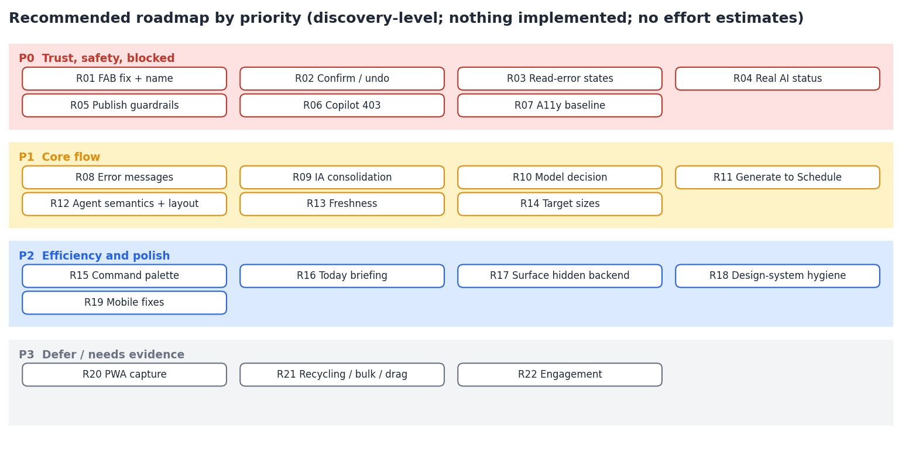

# UX Roadmap

Part of the ContentForge UX intelligence package. This is a discovery-level roadmap: it says what to fix, in what order, and how to know it is fixed. Nothing has been implemented, and no effort or date estimates are given because none can be grounded in evidence.



**22 recommendations:** 7 at P0, 7 at P1, 5 at P2, 3 at P3. Every recommendation maps to findings in the Evidence Ledger.

## How priorities were assigned

| Priority | Rule |
|---|---|
| P0 | The app misleads the operator, can publish or delete something irreversibly by accident, is broken on every screen, or fails a basic accessibility check on every page |
| P1 | Repairs the core daily loop, or is a decision that other work depends on |
| P2 | Efficiency, consistency and surfacing existing value |
| P3 | Spec-planned or competitor-derived; wait for evidence that it is wanted |

Priorities follow the operator's stated goal (a fast, safe daily ritual). They are judgements, not scores.

## P0: trust, safety and blocked

| ID | Priority | Recommendation | Addresses | Depends on |
|---|---|---|---|---|
| R01 | P0 | Fix Quick Capture positioning and give it an accessible name | UX-01, UX-24 | Owner of index.css utilities; Radix Button |
| R02 | P0 | Confirm-or-undo policy for destructive actions (use the existing AlertDialog primitive) | UX-02 | - |
| R03 | P0 | Read-failure state with retry on every list/dashboard query | UX-03 | Shared ErrorState component |
| R04 | P0 | Replace hardcoded AI Provider status with real status or neutral copy | UX-05 | Existence of a status endpoint (unverified) |
| R05 | P0 | Agent Workspace publish guardrails: real schedule picker, confirm with account + rendered preview, separate Approve from Publish | UX-06, UX-07 | Reuse Calendar dialog + x-post-preview.tsx |
| R06 | P0 | Resolve CopilotKit 403: send the CSRF token or unmount the provider until a Copilot UI exists | UX-09 | - |
| R07 | P0 | Accessibility baseline: route titles, allow zoom, names for icon buttons, landmarks + skip link, label the composer | UX-23, UX-24, UX-25, UX-26 | - |

## P1: core flow

| ID | Priority | Recommendation | Addresses | Depends on |
|---|---|---|---|---|
| R08 | P1 | Human-readable error layer between fetch failures and toasts; inline auth validation | UX-04, UX-29 | queryClient.ts |
| R09 | P1 | Information-architecture consolidation (candidate structure in INFORMATION_ARCHITECTURE.md), one label per destination, single ingestion entry, jargon removal | UX-12, UX-14, UX-15, UX-16, UX-17 | Usage data or owner decision (open question Q2) |
| R10 | P1 | Owner decision: which content model is the UI's source of truth; then bridge or migrate the legacy flows | UX-13 | Architecture decision record |
| R11 | P1 | Direct Generate-to-Schedule path; remove dead-end and zero-metric copy on Queue | UX-19, UX-20, UX-21 | R10 outcome |
| R12 | P1 | Agent run semantics (truthful status), approval control for waiting runs, responsive re-layout | UX-08, UX-10, UX-11 | - |
| R13 | P1 | Freshness policy for Queue/Calendar (refetch on focus or interval) | UX-22 | - |
| R14 | P1 | Target-size pass on undersized controls | UX-27 | - |

## P2: efficiency and polish

| ID | Priority | Recommendation | Addresses | Depends on |
|---|---|---|---|---|
| R15 | P2 | Command palette + shortcut map (cmdk primitive already present) | UX-32 | - |
| R16 | P2 | 'Today' landing / morning briefing (spec-planned, unbuilt) | Feature matrix F45 | R10 outcome; HYPOTHESIS on benefit |
| R17 | P2 | Surface hidden backend value: learning signals, voices, generation policies, automation policies | Feature matrix F36-F39 | R10 outcome |
| R18 | P2 | Design-system hygiene: shared PageHeader and Banner, 404 restyle, system theme, font trim, shadow tokens, icon reuse, chart axes | UX-18, 28, 31, 33, 34, 35, 36 | - |
| R19 | P2 | Mobile layout fixes on Generate, Calendar, Settings | UX-30 | - |

## P3: defer or gather evidence first

| ID | Priority | Recommendation | Addresses | Depends on |
|---|---|---|---|---|
| R20 | P3 | PWA / mobile capture path (spec-planned) | Feature matrix F48 | R01, R09 |
| R21 | P3 | Calendar drag-drop, evergreen recycling, bulk import - only if usage evidence supports | Feature matrix F50, F51, F53 | HYPOTHESIS (competitor-derived) |
| R22 | P3 | Engagement surface (spec-planned) | Feature matrix F46 | R16 proving out |

## Acceptance checks (how each P0 and P1 item is verified)

The same instruments used in this audit can be re-run: the 88-run axe crawl, the forced-500 state probes, and the scripted flows.

| Rec | Pass condition (observable) |
|---|---|
| R01 | Quick Capture's computed `position` is `fixed` and its rect is inside the viewport at 1440, 820 and 390 px; it has an accessible name |
| R02 | No `"DELETE"` call site in the client runs without either a confirm dialog or an undo affordance; the Queue delete probe shows a dialog or an undo toast |
| R03 | With GET requests forced to 500, each list and dashboard page shows an error state with a retry, not the empty state or zeros |
| R04 | The AI Provider tab reflects a real status, or contains no status claim that the app cannot verify |
| R05 | Schedule takes a chosen date and time; Publish Now shows the target account and rendered post and needs a second confirmation; Approve and Publish are visibly separate |
| R06 | No 403 is logged from `/api/agent/agui` on Agent Workspace load, or the provider is not mounted |
| R07 | axe: 0 `document-title`, 0 `meta-viewport`, 0 `button-name`, 0 `label`; a `nav` landmark and a skip link exist |
| R08 | The forced-error and auth probes show sentences, not `status: {json}`; the register form shows the password rule before submission |
| R09 | Sidebar destinations and page titles match one-to-one; the sidebar fits at 1440x900 without clipping |
| R10 | A written decision (ADR) names the source of truth; the UI states which model each screen shows |
| R11 | From a generated draft, the operator can schedule without leaving Generate, or Save as Draft links to the Queue item |
| R12 | Run status never reads "completed" when a required tool call failed; a waiting run offers approve and deny; the Agent Workspace is usable at 390 px without nested scroll traps |
| R13 | A status change made by the scheduler appears without a manual reload within a stated interval |
| R14 | No interactive element below 24x24 CSS px without a documented spacing exception; the under-44 px count trends down |

## Sequencing and dependencies

```
R01 R02 R03 R04 R05 R06 R07          (independent; can start in any order)
        |
        +--> shared components (ConfirmDialog, ErrorState, SchedulePicker) unblock R02, R03, R05, R11
R10 (decision) --> R09 --> R11, R16, R17, R20
R08, R12, R13, R14 (independent of R10)
R15, R18, R19 (independent, after the shared components exist)
R21, R22 wait for evidence
```

## Four-phase plan

| Phase | Contains | Entry | Exit |
|---|---|---|---|
| A. Stop the leaks | R01-R07 | Owner approval of the areas in SKILL_RECOMMENDATIONS.md | All R01-R07 pass conditions met; axe critical count is 0 |
| B. Straighten the core loop | R08-R14 | Q1 answered (R10) | J2 needs fewer actions than the 8 observed today; no page shows stale queue status; R08-R14 pass conditions met |
| C. Reduce and surface | R15-R19 | Phase B done; Q2 and Q3 answered | Sidebar and page titles align; hidden capabilities the owner chose have a screen; design-system inventory has no bespoke banners or headers |
| D. Extend | R20-R22 | Evidence from usage or the owner's request | Decided per item; nothing built by default |

Each phase ends with a re-audit using the same scripts so that improvement is measured on the same evidence base.

## What this roadmap deliberately does not contain

- A visual redesign. The token system is sound (DESIGN_SYSTEM_AUDIT.md).
- Effort, cost or date estimates.
- New features. See DONT_BUILD.md for what is excluded and why.
